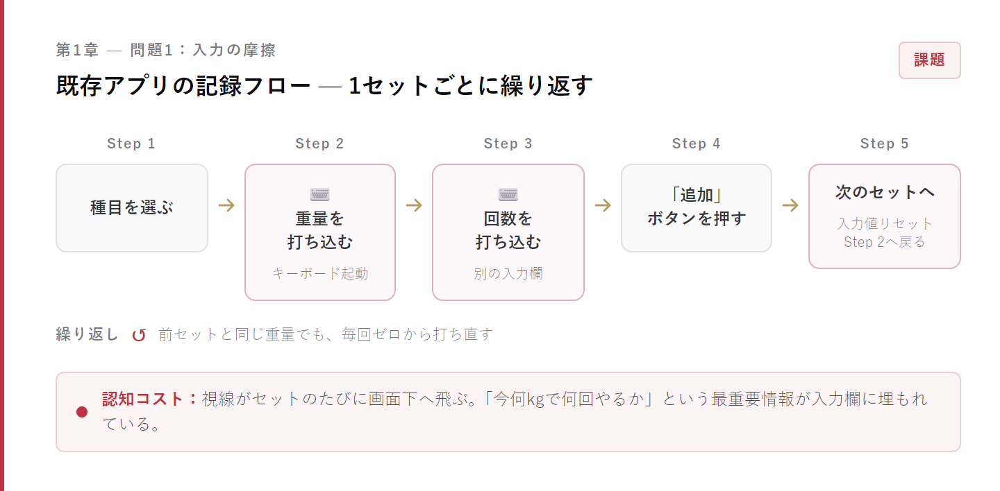
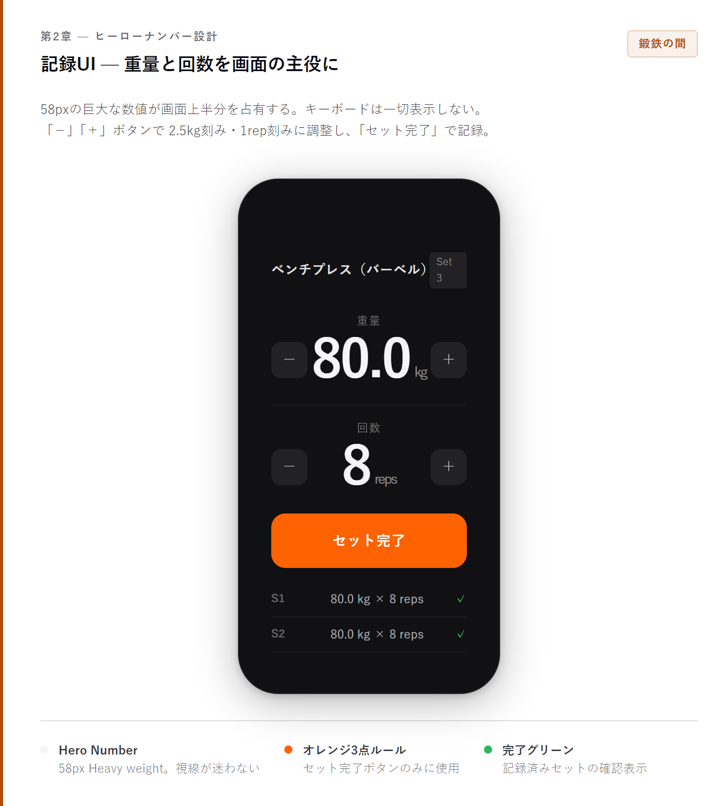
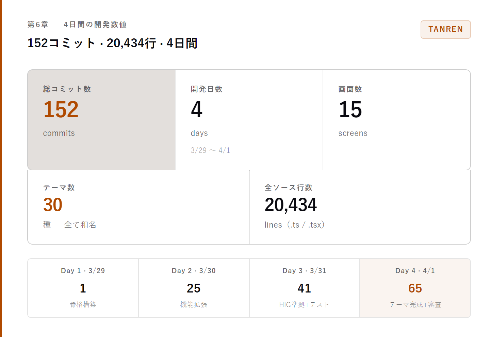
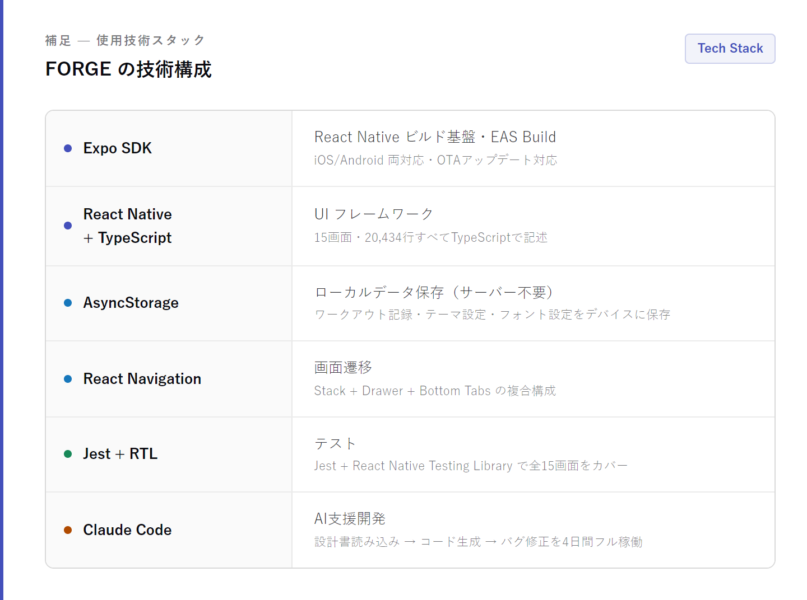

# 気に入らないなら自分で作る — 筋トレ記録アプリ「TANREN」をゼロから4日間で作った話

---

## はじめに — 「この入力、なんとかならないのか」

ジムに向かいながら、僕はスマホを取り出す。ベンチプレスをやろう。アプリを開いて、「胸」を選んで、「ベンチプレス」を選んで、テキスト入力欄に「80」と打って、レップ欄に「8」と打つ。1セット目完了。

次のセット。また同じように打つ。80kg、8回。

3セット目。80kg、8回。

この繰り返し。

「これ、前のセットと同じ重量なんだけど、なんでまた1から打ち直してるんだろう」と思いながらも、なんとなく使い続けてきた。でもある日、ふと気づいた。セットを完了するたびにキーボードが開く。前の入力値がリセットされてる。そして画面には「🔥 3日連続！やったね！」みたいな通知が来る。

いや、今は集中させてくれ。

そういう小さなストレスが積み重なって、「もういい、自分で作る」という結論に至った。それが、筋トレ記録アプリ「TANREN」の始まりだ。

**この記事で書くこと:**
- 既存の筋トレアプリが抱える3つの根本的な問題
- 「ヒーローナンバー」UI設計と3ステップフローの考え方
- 「鍛鉄の間」デザイン哲学——4人のデザイナーからの影響とオレンジ3点ルール
- 全30テーマ（和名）のカラーシステム設計
- 4日間・152コミット・2万行——AIと二人三脚で開発した実態

**目次:**
1. 第1章 既存の筋トレアプリ、何が問題だったのか
2. 第2章 理想のワークアウト記録UIを設計する
3. 第3章 テンプレートでさらに効率化する
4. 第4章 「鍛鉄の間」というデザイン思想
5. 第5章 30種のテーマ——和の色彩で筋トレを彩る
6. 第6章 4日間の爆速開発——AIと二人三脚で

---

TANRENは4日間で作ったiOSアプリだ。15の画面、30種のテーマ（すべて和名）、コントラスト調整スライダー、フォント設定、カスタム種目追加……これだけの機能を詰め込んで、コードは2万行を超えた。今この記事を書いている時点ではApp Storeの審査中だが、実機では快適に動いている。

「4日間でそんなに作れるの？」と思う人もいるだろう。その答えはあとの章で話す。まずは、なぜ既存のアプリに不満を持ったのかから始めよう。

---

## 第1章 — 既存の筋トレアプリ、何が問題だったのか

筋トレアプリは山ほどある。App Storeで「筋トレ」と検索すると、カラフルなアイコンがずらっと並ぶ。無料でも十分使えるものが多いし、記録機能という意味では大体同じことができる。

では何が不満だったのか。3つに整理してみる。

### 問題1: 入力の摩擦が多すぎる

一般的な筋トレアプリのUXはこうなっている。

1セットごとに、重量と回数をキーボードで打ち込む。前回と同じ重量でも、フォームには何も残っていない。キーボードが毎回開いて閉じる。視線が何度も画面の下のほうへ飛ぶ。

ジムにいるとき、人は重量を持ち上げることに集中したい。なのに、アプリ操作に認知コストを払い続けている。「今何kgで何回やるか」という一番大事な情報が、入力欄の中に埋もれていて目立たない。

### 問題2: 「今やっていること」が画面上で見えない

これは地味に大きい問題だ。

たとえばベンチプレスを80kgでやろうとしている。でもアプリの画面には「80」とテキスト欄に書かれているだけで、その数字が視覚的に際立っていない。重量欄と回数欄が横並びになっていて、どっちがどっちか一瞬迷う。セット番号はどこ？　終わったセットはどこに記録された？

「今、自分は何をやっているか」がひと目でわからない画面設計になっている。

### 問題3: ゲーミフィケーション過剰

筋トレアプリの多くは、モチベーションを維持させようとして、ゲームの要素を取り入れている。

連続記録バッジ、レベルアップ表示、「🔥 ストリーク継続中！」のアニメーション。

気持ちはわかる。でも、これが逆効果になることがある。トレーニング中に画面を見るたびに、バッジやアニメーションが目に入る。「いや、今は80kgを8回上げることだけ考えたいんだよ」というときに、外から注意を奪われる。

本来、筋トレの報酬は「鍛えた自分の体」と「前回より重くなった記録」だ。炎アイコンで褒めてもらわなくていい。

これら3つの不満が、「自分で作る」ことへの動機になった。

---

## 第2章 — 理想のワークアウト記録UIを設計する

じゃあ、どんなUIにすれば解決できるか。問題を整理したら、解決策も自然と見えてきた。

### 解決策1: 「ヒーローナンバー」設計

一番大事なことは、**「今何kgで何回やるか」を画面の主役にする**ことだ。

TANRENでは、重量と回数の数値を58〜64pxという巨大なサイズで表示する。これを「ヒーローナンバー」と呼んでいる。

画面の上半分を、重量と回数だけが占有している。数字を打ち込む欄はない。代わりに、「−」「＋」のボタンで2.5kg刻み・1rep刻みで調整できる。

キーボードは出てこない。重量を変えたいなら「＋」を押す。それだけ。

セットが完了したら「セット完了」ボタンをタップ。ボタンはオレンジからグリーンに変わり、そのセットの記録（80kg × 8reps）が下のログ行に追加される。

これだけで、前のアプリと比べてセット記録にかかる操作が激減した。

### 解決策2: 3ステップフロー

アプリ全体の構造も、できるだけシンプルにした。

**Step 1: 部位選択**  
胸・背中・脚・肩・腕・腹の6部位を2カラムグリッドで表示。背景色はなし、区切り線だけ。シンプルに選ぶだけ。

**Step 2: 種目選択**  
選んだ部位の種目リストが出る。ベンチプレス（バーベル）、ダンベルフライ（ダンベル）……タップで次へ。

**Step 3: 記録UI**  
ヒーローナンバーとセット完了ボタン。ここが主役の画面だ。

この3ステップで、「今日は胸トレしよう」からセット記録開始まで、3回のタップで到達できる。

### 解決策3: スワイプ削除とBottomSheet

セットを誤って記録してしまったとき、どう消す？

TANRENでは、セットログ行を左にスワイプすると赤い削除ボタンが現れる。誤タップを防ぐため、「スワイプ」というジェスチャーを削除のトリガーにしている。

また、前回の記録との比較は、Step 3の画面下部にスパークチャートとして常に表示される。「前回は75kgだったのに今日は80kgでいけた」「3セッション連続で同じ重量、停滞してる」——こういうことが、別画面に移動しなくてもわかる。

ただし、このスパークチャートにオレンジは使わない。それについては第4章で詳しく話す。

### 解決策4: BottomSheetによるインライン情報表示

履歴画面の日付や種目タグをタップすると、BottomSheetが下からスライドアップして、その日の詳細や種目の過去記録が表示される。

別画面に遷移しない。今いる画面の上に情報が重なってくる。確認して閉じる、それだけ。このパターンを履歴・進捗の両画面で一貫して使っている。

---

## 第3章 — テンプレートでさらに効率化する

UXの基本設計ができたところで、次に考えたのが「毎回同じ種目を選ぶのが面倒」という問題だ。

多くの人は、週ごとにだいたい同じメニューでトレーニングする。月曜は胸・三頭筋、水曜は背中・二頭筋、金曜は脚……という分割法を使っている人は多い。

毎回アプリを開いて「胸」→「ベンチプレス」→「胸」→「インクラインベンチ」→「腕」→「トライセップスプッシュダウン」と選んでいくのは、一応できるが面倒だ。

### テンプレート機能の設計

TANRENには「テンプレート」機能がある。

よく使う種目の組み合わせを、名前をつけて保存できる。たとえば「胸・三頭筋デイ」というテンプレートに、ベンチプレス・インクラインベンチ・ダンベルフライ・トライセップスプッシュダウンを登録しておく。

次のトレーニング日に「胸・三頭筋デイ」テンプレートを選んで開始すると、Step 3の記録UIに直接ジャンプできる。部位選択→種目選択の2ステップを省略できる。

ホーム画面には「クイックスタート」チップが横スクロールで並んでいる。よく使うテンプレートや種目がここに表示されて、1タップで記録を始められる。

### カスタム種目の追加

さらに、デフォルトの種目リストに含まれていない種目を追加する機能も作った。

「ケーブルフライ」「ペックデック」「ハックスクワット」……ジムによって使える器具は違うし、好みの種目も人それぞれだ。部位と器具種別を指定してカスタム種目を追加すると、以降は組み込み種目とまったく同じように扱われる。テンプレートにも追加できる。

### テンプレートの並び替え

テンプレート内の種目順は、「上へ」「下へ」ボタンで並び替えられる。

最初はドラッグ&ドロップで実装しようとしたが、スクロール可能なリストでのドラッグ操作は誤操作しやすいと判断して、シンプルなボタン方式に変えた。「より良いUXを作ろうとして、かえってUXを悪くする」パターンは意識して避けるようにした。

---

## 第4章 — 「鍛鉄の間」というデザイン思想

ここからは、少し技術的な話から離れて、デザインの話をする。

TANRENのデザインには「鍛鉄の間（Forged Iron Interval）」という名前をつけたコンセプトがある。機能を作りながら、なぜそのデザインを選ぶのかを言語化したくて、開発初日にデザイン思想書を書いた。

### 命名の由来

「鍛鉄（たんてつ）」は、鉄を打ち鍛える工程のことだ。不純物を高温で叩き出し、本質だけを残す。「間（ま）」は、日本語の空間・余白・沈黙の概念。

この2つを組み合わせた「鍛鉄の間」は、**削ぎ落とすことで生まれる力強い静寂**を意味する。

筋トレもアプリも、同じことだと思った。余分なものを全部削ぎ落としたら、何が残るか。それが本質だ。

### マニフェスト

デザイン思想書に書いたマニフェストをそのまま引用する。

> 「鉄を鍛えるとは、余分なものをすべて削ぎ落とす行為である。高温の炉、鎚の一撃、冷却の静寂。そのサイクルの繰り返しの中にこそ、鋼鉄の純粋性が宿る。このアプリもまた同じ原理で設計されなければならない。ユーザーの思考を奪うあらゆる装飾を取り除き、挙動そのものだけを残す。」

これが、ゲーミフィケーションを排除した理由でもある。炎アイコンもバッジも励ましコピーも、「ユーザーの思考を奪う」ものだと考えた。

### 4人のデザイナーからの影響

このコンセプトを作るにあたって、4人のデザイナーの哲学を参考にした。

**深澤直人（Naoto Fukasawa）**の「Without Thought」。インターフェースが消えて、行為そのものだけが残る状態。記録中はUIを忘れる。数字だけが存在する。そういう状態を目指した。

**ディーター・ラムス（Dieter Rams）**の「Less, but better」。存在理由のない要素は一切存在しない。UIは黙って道具であれ、挨拶文も励ましコピーも禁止。

**原研哉（Kenya Hara）**の「空という器」。アプリ自体は空洞の器であり、ユーザーの汗と成長で満たされていく。アプリが前に出るのではなく、ユーザーが主役。

**安藤忠雄（Tadao Ando）**の「光と構造のリズム」。密度と余白の交互出現が空間に生命を与える。記録UIという密な空間と、履歴・進捗という開放的な空間のコントラストを意識した。

### オレンジは「炉の一点の炎」

TANRENのデザインで、一番こだわったルールがこれだ。

**アクセントカラー（オレンジ、`#FF6200` 相当）は、画面上でちょうど3箇所だけ使う。**

1. ワークアウト開始ボタン（ホーム画面の主CTA）
2. アクティブタブのアイコン＋ラベル（タブバー）
3. セット完了ボタン（記録画面）

以上。統計グラフにも、PR数値にも、バッジにも使わない。

なぜか。オレンジがいたるところに使われると、「どこが一番大事な操作か」がわからなくなる。希少性が意味を与える。暗い鍛冶場の中で、炉の一点だけが燃えている——そのイメージだ。

### カラートークン設計

もう少し具体的な話をすると、TANRENのカラーシステムはこういうトークンで設計されている。

- `--bg`（`#111113`）: 背景——鍛冶場の闇
- `--s1`（`#191919`）: 第1表面——カードのほぼ不可視な浮き上がり
- `--s2`（`#222224`）: 第2表面——ボタン背景など
- `--t1`（`#F5F5F7`）: テキスト主——白に近い
- `--t2`（不透明度45%の白）: テキスト副
- `--t3`（不透明度22%の白）: キャプションなど
- `--ac`（`#FF6200`）: アクセント——灼熱オレンジ
- `--ok`（`#2DB55D`）: 完了グリーン

背景と第1表面の差はほぼ見えない。意識しないと気づかない程度の浮き上がり。それが「間（ま）」だ。主張しない構造が、ユーザーの視線を数字と操作だけに向けさせる。

---

## 第5章 — 30種のテーマ — 和の色彩で筋トレを彩る

機能とデザイン思想が固まった後、「テーマを増やしたい」という欲が出てきた。

「自分のアプリは自分好みの見た目にしたい」は、普通の欲求だと思う。黒背景が好きな人もいれば、白っぽいクリーンな見た目が好きな人もいる。

でも、ただ色を変えるだけでは面白くない。せっかくなら、テーマにも「鍛鉄の間」の世界観を込めたかった。

### 全30種——すべて和名

最終的に30種のテーマが完成した。全部に和名をつけて、それぞれにサブタイトルも書いた。

**ダークテーマ（11種）**

- 鍛鉄（アクセント: 灼熱橙）——「灼熱の一点が闇を穿つ」。デフォルトテーマ。
- 玉鋼（たまはがね）——「最高温は最も冷たい色で現れる」。青炎アクセント。
- 朱漆（しゅうるし）——「百層の朱が沈黙の深紅を生む」。深い赤。
- 翠嵐（すいらん）——「千年の雨が石に苔を着せる」。苔色グリーン。
- 月白（げっぱく）——「月明かりが鍛えた肉体を白く染める」。月光青。
- 紫電（しでん）——「一閃の紫が闇を裂く」。鮮烈な紫。
- 墨染（すみぞめ）——「墨が布に染み渡るように、静かに深く」。墨紫。
- 黒潮（くろしお）——「大洋の底から、蒼い力が湧き上がる」。深海蒼。
- そして桜煙・萌黄・曙光の3種（ピンク/ライムグリーン/サーモン系）。

**ライトテーマ（5種）**

- 白妙（しろたえ）——「神に捧げる白布に、鍛錬の対価が金に灯る」。古金アクセント。
- 白磁（はくじ）——「冷たい肌理に、藍の一筆が凛と走る」。染付藍。
- 花曇（はなぐもり）——「曇天に滲む薄紅が、鍛練のひと時を彩る」。薄紅。
- 青磁（せいじ）——「千年の翠が、鍛える者の力の色となる」。翡翠。
- 薄藤（うすふじ）——「朝露に霞む藤棚、静謐な紫が意志を帯びる」。藤紫。

**モノクロテーマ（2種）**

- 白鋼（はくこう）——「白紙に墨の一滴、それだけで十分」。
- 鉄墨（てつぼく）——「色を捨てた先に、数字だけが残る」。

**墨彩テーマ（6種）**

モノクロベースにカラーアクセントを1色だけ乗せたテーマ群。墨炎（オレンジ）、墨青（ブルー）、墨翠（グリーン）、白炎（レッド）、白青（ブルー）、白翠（グリーン）。

**渋彩テーマ（3種）**

低彩度のアクセントが特徴。灰白・錆色・古灰。渋い、落ち着いた見た目が好きな人向け。

**高コントラストライトテーマ（3種）**

アクセシビリティ重視で、コントラスト比を最大化したテーマ。雪白・月白（ライト）・白雪。

### コントラスト調整スライダー

テーマを選ぶだけでなく、細かい調整もできる。

設定画面にコントラストスライダーがある。2軸だ。

- **明度スライダー**: 背景・サーフェス・タブバーの明るさを調整（−20%〜+20%）
- **彩度スライダー**: アクセントカラーの鮮やかさを調整（−30%〜+30%）

「この鍛鉄テーマ、もう少し明るくしたい」「玉鋼のアクセントブルーをもっと鮮やかに」——そういう微調整がスライダー1本でできる。設定はAsyncStorageに保存されるので、アプリを再起動しても維持される。

### フォント設定

さらに、フォントも3軸でカスタマイズできる。

- **サイズスケール**: 0.80x〜1.30xの範囲。ヒーローナンバーからキャプションまで全体が連動して大きくなる。
- **ウェイトレベル**: 細め・標準・太め。「標準」は重量表示が800相当のHeavyウェイト。太め設定にすると全体的にどっしりした印象になる。
- **フォントファミリー**: システムフォント（SF Pro）、セリフ（Georgia系）、モノスペース（Menlo系）の3種類。

モノスペースフォントで数字を表示すると、重量の変化が桁ごとに揃って見えて、独特の計器感が出る。個人的に気に入っている設定だ。

---

## 第6章 — 4日間の爆速開発 — AIと二人三脚で

ここまで読んで、「15画面・20,000行・30テーマを4日で？」と思った人のために、開発プロセスの話をする。

### Day 1（3月29日）: 1コミットで骨格を構築

初日は1コミットだけだ。でもそのコミットがでかい。

「TANREN初期実装」というコミットで、以下のものが一気に実装された。

- ワークアウト記録UIの基盤（部位→種目→セット記録のフロー）
- WorkoutContext（データ管理のReact Context）
- ThemeContext（テーマ管理）
- Drawerナビゲーション構造
- テーマシステムの初版

1日目の夜に、すでにアプリの骨格が動いていた。

これが可能だったのは、**Claude Codeというツールを使ったから**だ。

Claude CodeはAnthropicが作ったAI開発アシスタントで、コードを書いてくれるだけでなく、設計書を読んでコードを生成し、バグを発見して修正し、テストを書く——これを高速で繰り返す。

初日の前に、デザイン思想書（TANREN_design.md）と機能仕様書（spec.md）をClaude Codeと一緒に作り込んだ。仕様が言語化されていたから、コード生成の指示が明確になった。「仕様書に従ってWorkoutContextを実装して」と言えば、型定義からContextまで一気に書いてくれる。

### Day 2（3月30日）: 25コミットで機能拡張

2日目は密度が高かった。テンプレート機能、ナビゲーション改善、UIの細部調整、バグ修正が25コミット分積み上がった。

バグ修正の中でも面白かったのは「セット行タップ時のデータ消失」だ。セットログ行をタップすると記録が消えるというバグで、原因はReact Nativeのタッチイベントの伝播にあった。

こういうバグも、エラーメッセージと症状を伝えると、Claude Codeが原因を特定してパッチを提案してくれる。「なぜ起きるか」の説明付きで。

### Day 3（3月31日）: 41コミット — iOS HIG準拠 + テスト

3日目は量が多かった。41コミット。

UIをiOS Human Interface Guidelines（HIG）に合わせるリファクタ、そして**全画面のテストコード追加**。

テストフレームワークはJest + React Native Testing Library。「コンポーネントが正しく描画されるか」「ボタンタップで期待通りの状態変化が起きるか」を全15画面分書いた。

テスト基盤を入れたことで、その後のリファクタが怖くなくなった。変更を加えてテストを走らせる、落ちたテストを直す——この繰り返しが安全な開発の基礎になった。

### Day 4（4月1日）: 65コミット — テーマ完成・iOS審査対応

最終日が一番コミット数が多い。65コミット。

テーマシステムを30種に拡張し、フォント設定機能を追加し、カスタム種目機能を実装し、iOS審査のためのプライバシーポリシー・利用規約画面を追加し、App Store Connectへの提出準備をすべて終えた。

### 文字化け事件

一つ印象的なエピソードを紹介する。

4日目の途中で、突然アプリのあちこちで文字化けが発生した。設定画面の「設定」「データ」「ホーム」といった日本語テキストが、意味不明な文字の羅列になっていた。

原因は**PowerShellのエンコーディング問題**だった。WindowsのPowerShellはデフォルトのエンコーディングがUTF-8でない場合があり、ファイルを読み書きするスクリプトを経由したときに日本語が破損していた。

この修正のために、SettingsScreen.tsxだけで37箇所の文字化けを直すことになった。一行一行、正しい文字列に戻していく作業。Claude Codeで「このファイルの文字化け37箇所を修正して」と伝えて、半自動で対応した。

手動でやっていたら1時間はかかっていた作業が、15分で終わった。

### 開発数値の振り返り

4日間の最終成果を数字で整理するとこうなる。

152コミット、20,000行を超えるコードが4日間で積み上がった。Claude Codeがなければ、これは物理的に不可能だったと思う。設計・コーディング・テスト・デバッグを人間とAIが並列でこなした結果だ。

---

## まとめ — 気に入らないなら、自分で作ればいい

「既存のアプリが気に入らない → 自分で作る」というのは、かつてはハードルが高かった。設計、コーディング、テスト、アプリストア対応……ひとりでこなすには時間も技術も必要だった。

でも今は、AIと二人三脚で開発する手段がある。

TANRENを作りながら気づいたのは、「自分が本当に使いたいものを作る」ことの純粋な楽しさだ。ヒーローナンバーのUIが完成したとき、「これだ」という手応えがあった。30種のテーマが揃って、設定画面でリアルタイムに切り替えられるようになったとき、一人でテンションが上がった。

アプリを作るのに「すごい技術者でなければいけない」時代は終わっていると思う。「こういうものが欲しい」という具体的なビジョンがあって、それを丁寧に言語化できれば、AIがコードにしてくれる。

TANRENはまだApp Storeの審査中だが、記事を読んでくれた人に少しでも「個人開発、やってみようかな」と思ってもらえたら嬉しい。

そして筋トレをやっている人、既存のアプリに不満がある人——TANRENを使ってみてください。重量と回数だけが画面の主役のアプリは、きっと気に入ってもらえると思う。

---

*2026年4月 / TANREN開発者*

---

## 補足: 使用技術スタック

